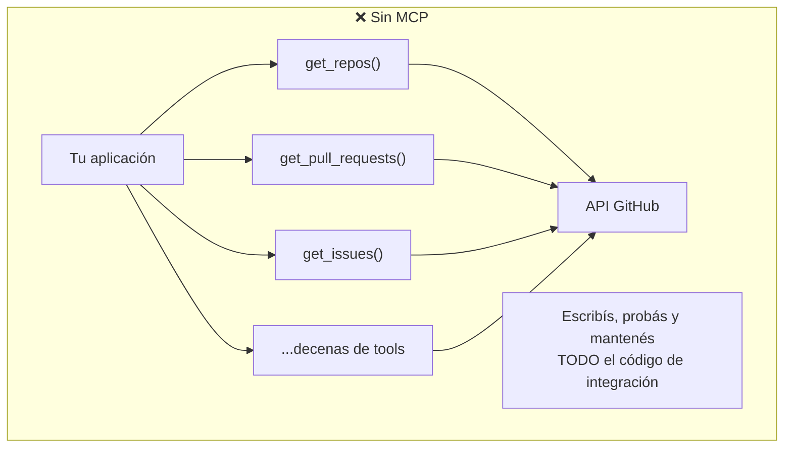
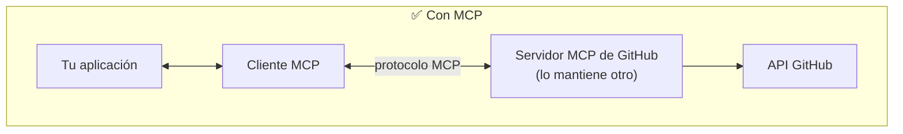

# 01 — Qué es MCP y qué problema resuelve

## La idea en una frase

El **Model Context Protocol (MCP)** es una capa de comunicación que le da al modelo el **contexto** y las **herramientas** que necesita, sin que vos tengas que escribir un montón de código de integración tedioso.

La clave: MCP **traslada la responsabilidad** de definir y ejecutar herramientas desde tu aplicación hacia **servidores MCP especializados**.

> **Nota sobre el "modelo".** MCP es un estándar abierto **independiente del proveedor**: donde leas "el modelo" o "el LLM", aplica a cualquiera (Claude, GPT, Gemini, modelos locales...). Los proyectos de ejemplo usan Claude solo como implementación concreta. Ver [Independiente del modelo](../README.md#independiente-del-modelo-model-agnostic) en el README.

## El problema que resuelve

Supongamos que armás una interfaz de chat donde los usuarios le preguntan al modelo sobre sus datos de GitHub. Un usuario escribe:

> "¿Qué pull requests abiertas tengo en todos mis repos?"

Para responder, el modelo necesita herramientas para acceder a la API de GitHub. Y GitHub es **enorme**: repos, pull requests, issues, proyectos, releases, webhooks... Sin MCP, tendrías que:

1. Escribir el esquema JSON de **cada** herramienta.
2. Implementar la función que llama a la API de GitHub.
3. Probar, mantener y versionar todo ese código de integración vos mismo.

Es muchísimo trabajo y una carga de mantenimiento permanente.

## Cómo lo resuelve MCP

MCP elimina esa carga: la definición y ejecución de herramientas se mudan a un **servidor MCP dedicado**. En lugar de construir todas las tools de GitHub, un **servidor MCP de GitHub** ya las trae listas y las expone de forma **estandarizada**. Tu app simplemente se conecta a ese servidor.

## ¿Qué es un servidor MCP?

Un servidor MCP **expone acceso** a datos o funcionalidad implementada por un servicio externo. Actúa como una **interfaz especializada** que publica herramientas, recursos e indicaciones de forma estándar.

En el ejemplo de GitHub, el servidor MCP incluye tools como `get_repos()` y se conecta directo a la API de GitHub. Tu app habla con el servidor MCP; el servidor se encarga de todos los detalles específicos de GitHub.

## Preguntas frecuentes

**¿Quién escribe los servidores MCP?**
Cualquiera puede crear uno. A menudo el propio proveedor del servicio publica su implementación **oficial**. Por ejemplo, AWS podría lanzar un servidor MCP oficial con tools para sus servicios.

**¿En qué se diferencia de llamar a la API directamente?**
Un servidor MCP ya trae los esquemas y funciones de las tools **definidos**. Si llamás a la API directo, tenés que definir esas tools vos mismo. MCP te ahorra ese trabajo de implementación.

**¿No es lo mismo que "tool use"?**
Error común. Son conceptos **complementarios pero distintos**:

- **MCP** provee esquemas y funciones de herramientas ya implementadas.
- **Tool use** es *cómo* el modelo decide llamarlas.

La diferencia clave es **quién hace el trabajo**: con MCP, alguien más ya implementó las herramientas. En lugar de mantener un set complejo de integraciones, aprovechás servidores MCP que se encargan del trabajo pesado de conectarse a servicios externos.

## Para llevar

- MCP es una **capa de comunicación estandarizada** entre tu app y servicios externos.
- Mueve la **definición y ejecución de tools** a servidores MCP especializados.
- Te ahorra escribir y mantener integraciones a mano.
- "Servidor MCP" ≠ "tool use": el servidor *provee* las tools; el tool use es *cómo* el modelo las usa.

➡️ Siguiente: [02 — Arquitectura y flujo de mensajes](./02-arquitectura-y-flujo.md)
