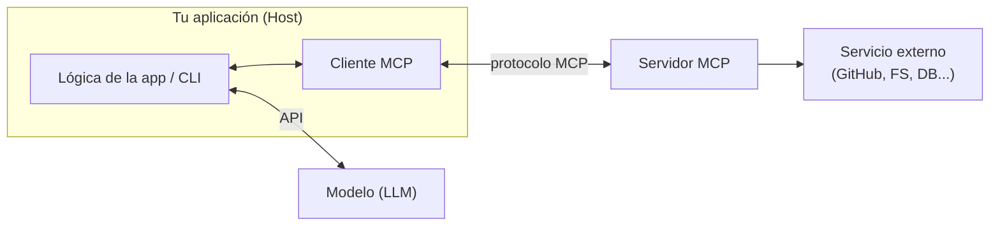
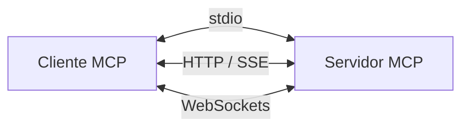
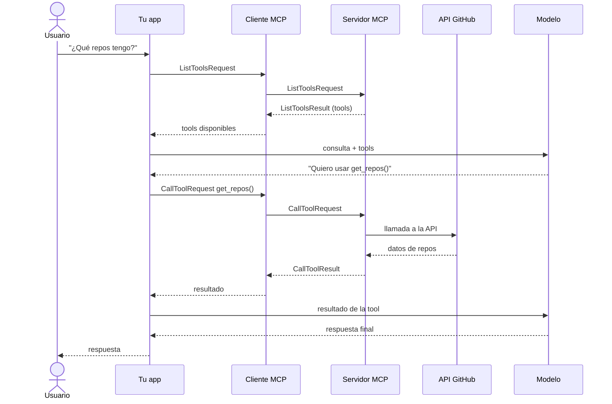

# 02 — Arquitectura y flujo de mensajes

## Las piezas

Un sistema MCP tiene tres roles principales:

- **Host / aplicación:** tu código (en este curso, una CLI de chat).
- **Cliente MCP:** el puente que habla con el servidor MCP. Gestiona el protocolo y el intercambio de mensajes para que tu app no tenga que hacerlo.
- **Servidor MCP:** expone tools, recursos y prompts conectados a un servicio externo.

> En proyectos reales solés implementar **o** un cliente **o** un servidor, no ambos. En este curso construimos los dos para ver cómo encajan.

## Independiente del transporte

Una de las grandes ventajas de MCP es que es **independiente del transporte**: cliente y servidor pueden comunicarse por distintos protocolos según la configuración.

La configuración más común corre cliente y servidor en la **misma máquina**, comunicándose por **entrada/salida estándar (stdio)**. Pero también podés usar HTTP, WebSockets u otros protocolos de red. (El detalle de transportes está en el [Módulo 2](../Model%20Context%20Protocol_%20Advanced%20Topics/05-transporte-stdio.md).)

## Tipos de mensajes principales

Una vez conectados, cliente y servidor intercambian mensajes definidos en la especificación. Los dos pares con los que más vas a trabajar:

| Request | Result | Para qué |
|---------|--------|----------|
| `ListToolsRequest` | `ListToolsResult` | "¿Qué herramientas ofrecés?" → lista de tools |
| `CallToolRequest` | `CallToolResult` | "Ejecutá esta tool con estos argumentos" → resultado |

## El flujo completo de una consulta

Veamos qué pasa, paso a paso, cuando un usuario pregunta **"¿Qué repos tengo?"**:

En palabras:

1. **Consulta del usuario** → llega a tu app.
2. **Descubrimiento de tools** → tu app pide al cliente MCP las tools disponibles.
3. **Intercambio de lista** → el cliente manda `ListToolsRequest` y recibe `ListToolsResult`.
4. **Pedido al modelo** → tu app envía la consulta + las tools al modelo.
5. **Decisión** → el modelo decide que necesita llamar una tool.
6. **Ejecución** → tu app pide al cliente que ejecute la tool elegida.
7. **Llamada externa** → el cliente manda `CallToolRequest`; el servidor llama a GitHub.
8. **Vuelta del resultado** → GitHub responde, fluye de vuelta como `CallToolResult`.
9. **Resultado al modelo** → tu app le pasa el resultado al modelo.
10. **Respuesta final** → el modelo formula la respuesta y el usuario la recibe.

Son varios pasos, pero cada componente tiene una función clara. El **cliente MCP simplifica la comunicación** con el servidor, así vos te concentrás en la lógica de tu app mientras accedés a herramientas y datos externos potentes.

## Para llevar

- Tres roles: **host/app**, **cliente MCP** y **servidor MCP**.
- MCP es **independiente del transporte** (stdio, HTTP, WebSockets).
- Los mensajes vienen en pares **request/result** (`ListTools`, `CallTool`).
- Entender este flujo es clave: lo vas a ver entero al construir tu servidor y cliente.

➡️ Siguiente: [03 — Herramientas e Inspector](./03-herramientas-e-inspector.md)
