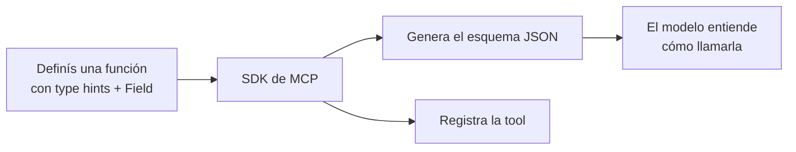
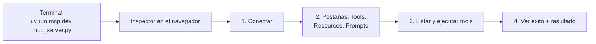

# 03 — Herramientas (tools) e Inspector

Las **herramientas** son funciones que el servidor MCP expone para que el modelo las **ejecute**. En este módulo construimos un servidor de gestión documental con dos tools: leer y editar documentos.

## Configurar el servidor con FastMCP

El SDK oficial de Python hace que crear un servidor MCP sea muy simple. En lugar de escribir esquemas JSON a mano, usás decoradores y dejás que el SDK haga el trabajo pesado.

```python
from mcp.server.fastmcp import FastMCP

mcp = FastMCP("DocumentMCP", log_level="ERROR")
```

Los documentos se guardan en memoria, en un diccionario simple (clave = id, valor = contenido):

```python
docs = {
    "deposition.md": "Esta declaración cubre el testimonio de Angela Smith, PE",
    "report.pdf": "El informe detalla el estado de una torre condensadora de 20 m.",
    "financieros.docx": "Estos estados financieros describen el presupuesto y los gastos del proyecto",
    "outlook.pdf": "Este documento presenta el rendimiento futuro proyectado del sistema",
    "plan.md": "El plan describe los pasos para la implementación del proyecto.",
    "spec.txt": "Estas especificaciones definen los requisitos técnicos del equipo",
}
```

## Definir tools con decoradores

El SDK usa decoradores. Con *type hints* de Python y descripciones de campos, **genera el esquema automáticamente** para que el modelo lo entienda.

### Tool de lectura

```python
from pydantic import Field

@mcp.tool(
    name="read_doc_contents",
    description="Lee el contenido de un documento y lo devuelve como string.",
)
def read_document(
    doc_id: str = Field(description="ID del documento a leer"),
):
    if doc_id not in docs:
        raise ValueError(f"No se encontró el documento con ID {doc_id}")
    return docs[doc_id]
```

El decorador define **nombre** y **descripción** de la tool; los parámetros de la función definen los **argumentos**. La clase `Field` de Pydantic aporta descripciones que ayudan al modelo a entender qué espera cada parámetro.

### Tool de edición

```python
@mcp.tool(
    name="edit_document",
    description="Edita un documento reemplazando una cadena por otra.",
)
def edit_document(
    doc_id: str = Field(description="ID del documento a editar"),
    old_str: str = Field(description="Texto a reemplazar. Debe coincidir exacto, incluidos espacios."),
    new_str: str = Field(description="Texto nuevo a insertar en lugar del anterior."),
):
    if doc_id not in docs:
        raise ValueError(f"No se encontró el documento con ID {doc_id}")
    docs[doc_id] = docs[doc_id].replace(old_str, new_str)
```

Tres parámetros (id, texto a buscar, texto de reemplazo), manejo de error para documentos faltantes y un *replace* simple.

## Por qué conviene el SDK



- No escribís esquemas JSON a mano.
- Los *type hints* dan validación automática.
- Las descripciones de parámetros ayudan al modelo a usar bien la tool.
- El manejo de errores se integra natural con las excepciones de Python.
- El registro de la tool es automático vía decorador.

## El Inspector de MCP

Para probar el servidor **sin** conectar una app completa, el SDK trae un **Inspector** basado en navegador.

```bash
uv run mcp dev mcp_server.py
```

Esto levanta un server de desarrollo y te da una URL local (algo como `http://127.0.0.1:6274`). Abrila en el navegador.



Flujo típico:

1. Hacé clic en **Conectar** para inicializar el servidor (el estado pasa de *Desconectado* a *Conectado*).
2. Andá a **Tools** → **Listar herramientas**.
3. Elegí una tool (por ej. `read_doc_contents`), cargá un argumento (`deposition.md`) y **Ejecutar**.
4. Revisá el estado de éxito y los datos devueltos.

Podés encadenar tools para verificar flujos: editá un documento y después leelo para confirmar que el cambio se aplicó. El inspector **mantiene el estado** del servidor entre llamadas.

### Por qué importa el Inspector

Es parte central del ciclo de desarrollo. En vez de escribir scripts de prueba sueltos o conectar apps completas, podés:

- Iterar rápido sobre la implementación de tools.
- Probar casos límite y condiciones de error.
- Verificar interacciones entre tools y el manejo del estado.
- Depurar en tiempo real.

## Para llevar

- Las tools se definen con `@mcp.tool(...)` y *type hints*; el SDK genera el esquema.
- Las tools están **controladas por el modelo**: el modelo decide cuándo llamarlas.
- El **Inspector** (`mcp dev`) te deja probar el servidor en el navegador antes de conectar una app.

➡️ Siguiente: [04 — Implementar el cliente MCP](./04-cliente-mcp.md)
