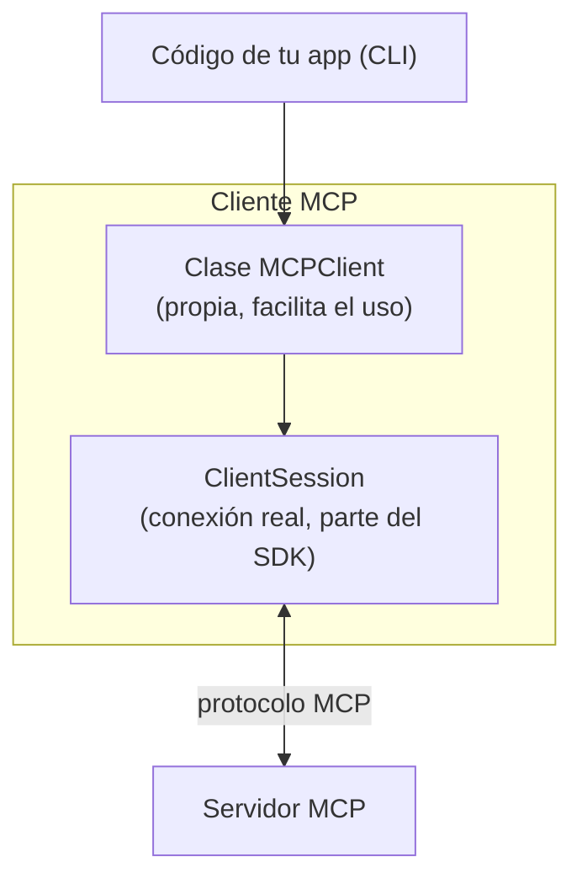
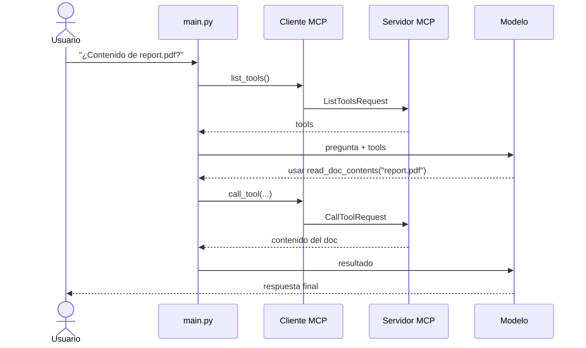

# 04 — Implementar el cliente MCP

Con el servidor funcionando, toca el **cliente**: lo que permite que el código de tu app se comunique con el servidor MCP y acceda a sus capacidades.

## Arquitectura del cliente

El cliente MCP tiene dos componentes:



- **`ClientSession`**: la conexión real con el servidor (la trae el SDK).
- **Clase propia (`MCPClient`)**: envuelve la sesión para que sea cómoda de usar y, sobre todo, para **cerrar bien las conexiones** al terminar. La sesión necesita manejo cuidadoso de recursos; al encapsularla, la limpieza es automática.

## Dónde encaja el cliente

¿Te acordás del [flujo completo](./02-arquitectura-y-flujo.md)? El cliente es lo que conecta tu código con el servidor MCP en **dos puntos clave**:

1. **Obtener la lista de tools** para enviársela al modelo.
2. **Ejecutar las tools** cuando el modelo las pide.

## Las dos funciones esenciales

### `list_tools()`

Obtiene todas las tools disponibles del servidor:

```python
async def list_tools(self) -> list[types.Tool]:
    result = await self.session().list_tools()
    return result.tools
```

Simple: accedés a la sesión, llamás al `list_tools()` integrado y devolvés las tools del resultado.

### `call_tool()`

Ejecuta una tool específica en el servidor:

```python
async def call_tool(
    self, tool_name: str, tool_input: dict
) -> types.CallToolResult | None:
    return await self.session().call_tool(tool_name, tool_input)
```

Le mandás el nombre y los argumentos (que vienen del modelo) y devolvés el resultado.

## Probar el cliente

El archivo del cliente trae un pequeño programa de prueba al final. Lo corrés directo:

```bash
uv run mcp_client.py
```

Esto se conecta al servidor e imprime las tools disponibles: vas a ver las definiciones, descripciones y esquemas de entrada.

## Unir todo

Con las funciones del cliente listas, probás el flujo completo corriendo la app:

```bash
uv run main.py
```

Probá preguntar: **"¿Cuál es el contenido del documento report.pdf?"**



El cliente actúa como **puente** entre la lógica de tu app y la funcionalidad del servidor MCP, integrando herramientas potentes en tus flujos de IA sin complicar tu código.

## Para llevar

- El cliente = `ClientSession` (SDK) + una clase propia que maneja la limpieza.
- Implementás `list_tools()` y `call_tool()`.
- Esas dos funciones cubren los dos puntos donde tu app necesita al servidor MCP.

➡️ Siguiente: [05 — Recursos](./05-recursos.md)
