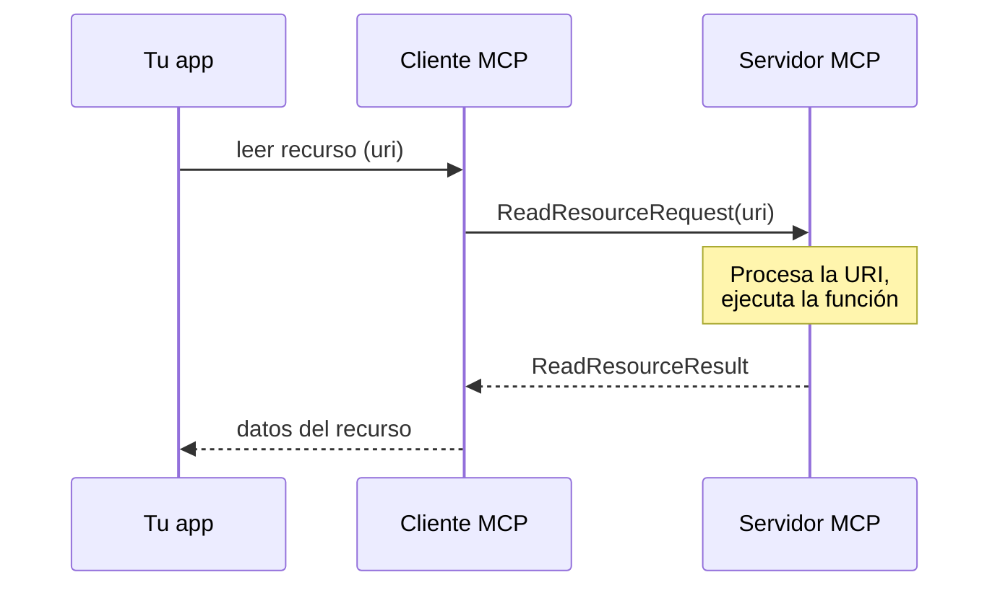
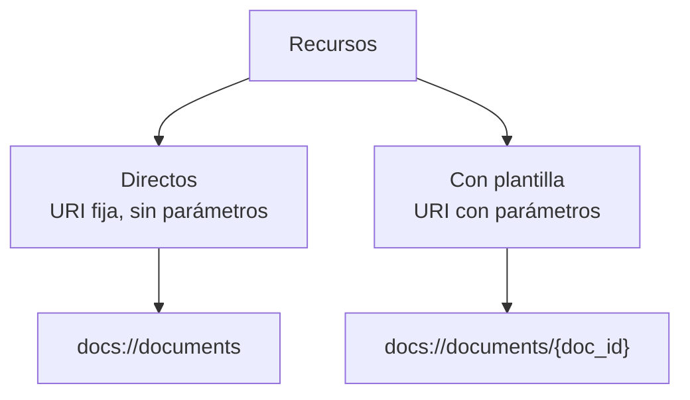

# 05 — Recursos (resources)

Los **recursos** permiten que el servidor MCP **exponga datos** al cliente, parecido a un handler `GET` en un servidor HTTP. Son ideales cuando necesitás **obtener información**, no ejecutar acciones.

## El ejemplo: menciones con `@`

Querés que los usuarios escriban `@nombre_del_documento` para referenciar archivos. Eso requiere dos operaciones:

1. Listar todos los documentos disponibles (para autocompletar).
2. Obtener el contenido de un documento puntual (cuando se lo menciona).

Cuando el usuario menciona un documento, tu sistema **inserta automáticamente** su contenido en el mensaje que va a Claude. Así Claude no necesita usar una tool para obtener esa info: ya viene en el contexto.

## Cómo funcionan

Los recursos siguen un patrón **request/response**. Cuando el cliente necesita datos, manda un `ReadResourceRequest` con una **URI** que identifica el recurso. El servidor lo procesa y devuelve un `ReadResourceResult`.



## Dos tipos de recursos



### Recursos directos

URI estática que nunca cambia. Perfectos para operaciones sin parámetros.

```python
@mcp.resource(
    "docs://documents",
    mime_type="application/json",
)
def list_docs() -> list[str]:
    return list(docs.keys())
```

### Recursos con plantilla

Incluyen parámetros en la URI. El SDK los parsea automáticamente y los pasa como argumentos con nombre.

```python
@mcp.resource(
    "docs://documents/{doc_id}",
    mime_type="text/plain",
)
def fetch_doc(doc_id: str) -> str:
    if doc_id not in docs:
        raise ValueError(f"No se encontró el documento con ID {doc_id}")
    return docs[doc_id]
```

## El `mime_type`

Los recursos pueden devolver cualquier tipo de dato. Usá `mime_type` para indicarle al cliente cómo interpretarlo:

| `mime_type` | Para |
|-------------|------|
| `application/json` | Datos estructurados |
| `text/plain` | Texto plano |
| `application/pdf` | Binarios |

El SDK **serializa automáticamente** los valores de retorno: no convertís objetos a JSON a mano, devolvés la estructura y el SDK se encarga.

## Implementar la lectura en el cliente

Para habilitar el acceso a recursos en el cliente, implementás `read_resource`:

```python
import json
from pydantic import AnyUrl

async def read_resource(self, uri: str) -> Any:
    result = await self.session().read_resource(AnyUrl(uri))
    resource = result.contents[0]

    if isinstance(resource, types.TextResourceContents):
        if resource.mimeType == "application/json":
            return json.loads(resource.text)
    return resource.text
```

La respuesta trae una **lista de contenidos**; tomamos el primero (normalmente alcanza con uno). Incluye el contenido real, el `mimeType` que nos dice cómo parsearlo y metadatos. La función decide: si es `application/json`, parsea; si no, devuelve texto plano.

## Probar los recursos

En el [Inspector](./03-herramientas-e-inspector.md):

```bash
uv run mcp dev mcp_server.py
```

Vas a ver dos secciones: **Resources** (directos) y **Resource Templates** (con plantilla). Para los de plantilla te pide los parámetros. El inspector muestra la respuesta exacta que recibirá tu cliente, con tipo MIME y datos serializados.

En la CLI, al escribir `@` seguido de un nombre, el sistema:

1. Muestra los recursos disponibles en autocompletado.
2. Te deja elegir con flechas/espacio.
3. Inserta el contenido del recurso directo en tu pregunta.
4. Manda todo a Claude **sin** llamadas a tools extra.

Esto da una experiencia más fluida: el contenido pasa a formar parte del contexto inicial y las respuestas son inmediatas.

## Para llevar

- Los recursos exponen **datos de solo lectura** (patrón `GET`).
- Están **controlados por la aplicación**: tu código decide cuándo leerlos.
- Dos tipos: **directos** (URI fija) y **con plantilla** (URI con parámetros).
- `mime_type` le dice al cliente cómo interpretar la respuesta.

➡️ Siguiente: [06 — Prompts](./06-prompts.md)
