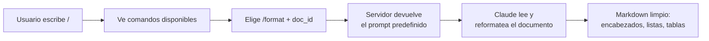
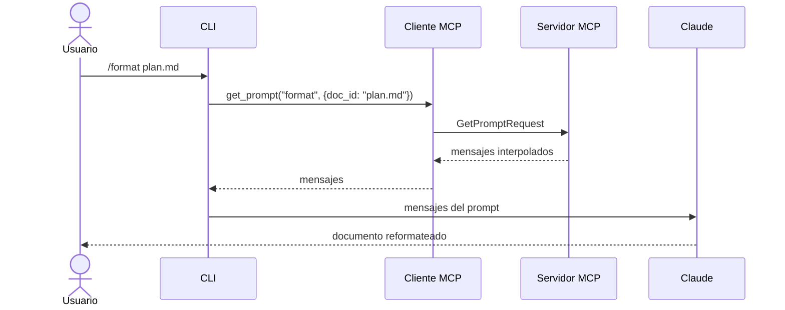

# 06 — Prompts (indicaciones)

Los **prompts** permiten definir instrucciones predefinidas y de alta calidad que los clientes pueden usar en lugar de escribir las suyas desde cero. Pensalos como **plantillas cuidadosamente diseñadas** que dan mejores resultados que lo que un usuario armaría a las apuradas.

## ¿Por qué usar prompts?

Un usuario ya puede pedirle a Claude casi cualquier cosa directamente. Por ejemplo: *"reformateá report.pdf a Markdown"* y obtener algo aceptable. Pero el resultado es **mucho mejor** con un prompt especializado y probado que contempla casos límite y sigue buenas prácticas.

Como autor del servidor MCP, dedicás tiempo a **diseñar, probar y evaluar** prompts que funcionan consistentemente en distintos escenarios. Los usuarios se benefician de esa experiencia sin tener que volverse expertos en *prompt engineering*.

## Ejemplo: comando `/format`

Un comando que convierte documentos a Markdown. El usuario escribe `/format doc_id` y obtiene su documento formateado profesionalmente.



## Definir prompts

Mismo patrón de decoradores que tools y recursos:

```python
from mcp.server.fastmcp.prompts import base
from pydantic import Field

@mcp.prompt(
    name="format",
    description="Reescribe el contenido de un documento en formato Markdown.",
)
def format_document(
    doc_id: str = Field(description="ID del documento a formatear"),
) -> list[base.Message]:
    prompt = f"""
    Tu objetivo es reformatear un documento para que use sintaxis Markdown.

    El ID del documento a reformatear es:
    <document_id>
    {doc_id}
    </document_id>

    Agregá encabezados, viñetas, tablas, etc. según haga falta.
    Usá la tool 'edit_document' para editar el documento. Una vez reformateado...
    """
    return [
        base.UserMessage(prompt),
    ]
```

La función devuelve una **lista de mensajes** que se envían directo a Claude. Podés incluir varios mensajes de usuario y asistente para armar flujos conversacionales más complejos.

## Prompts en el cliente

El último paso del cliente es implementar la funcionalidad de prompts: listar los disponibles y recuperar uno concreto con sus variables.

### `list_prompts()`

```python
async def list_prompts(self) -> list[types.Prompt]:
    result = await self.session().list_prompts()
    return result.prompts
```

### `get_prompt()`

Más interesante, porque maneja la **interpolación de variables**. Cuando pedís un prompt, le pasás argumentos que llegan a la función como argumentos con nombre:

```python
async def get_prompt(self, prompt_name, args: dict[str, str]):
    result = await self.session().get_prompt(prompt_name, args)
    return result.messages
```

Si tu servidor tiene un prompt `format_document` que espera `doc_id`, el diccionario de argumentos sería `{"doc_id": "plan.md"}`. Ese valor se interpola en la plantilla.

## Cómo funcionan, en resumen



1. Redactás y evaluás un prompt relevante para tu servidor.
2. Lo definís con `@mcp.prompt`.
3. El cliente puede pedirlo en cualquier momento.
4. Los argumentos del cliente se vuelven *keyword arguments* en tu función.
5. La función devuelve mensajes formateados, listos para el modelo.

## Beneficios clave

| Beneficio | Qué significa |
|-----------|---------------|
| **Consistencia** | Resultados confiables siempre |
| **Experiencia** | Codificás conocimiento de dominio en el prompt |
| **Reutilización** | Varios clientes usan el mismo prompt |
| **Mantenimiento** | Actualizás en un solo lugar y mejorás todos los clientes |

Los prompts rinden mejor cuando están **especializados** para el dominio de tu servidor: formatear, resumir o analizar documentos en un servidor documental; generar informes o visualizaciones en uno de análisis de datos. El objetivo es que estén tan bien elaborados que los usuarios los prefieran a escribir los suyos.

## Para llevar

- Los prompts son **plantillas de mensajes** predefinidas y probadas.
- Están **controlados por el usuario**: se disparan con acciones (comandos `/slash`, botones).
- Se definen con `@mcp.prompt` y devuelven una lista de mensajes.
- El cliente los lista con `list_prompts()` y los recupera (interpolando variables) con `get_prompt()`.

➡️ Siguiente: [07 — Repaso de las 3 primitivas](./07-primitivas-mcp.md)
