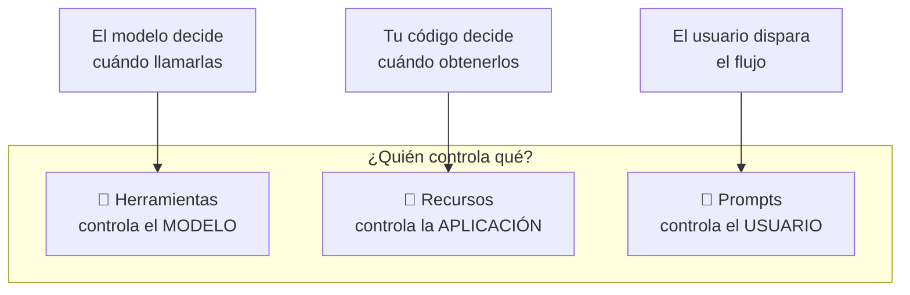
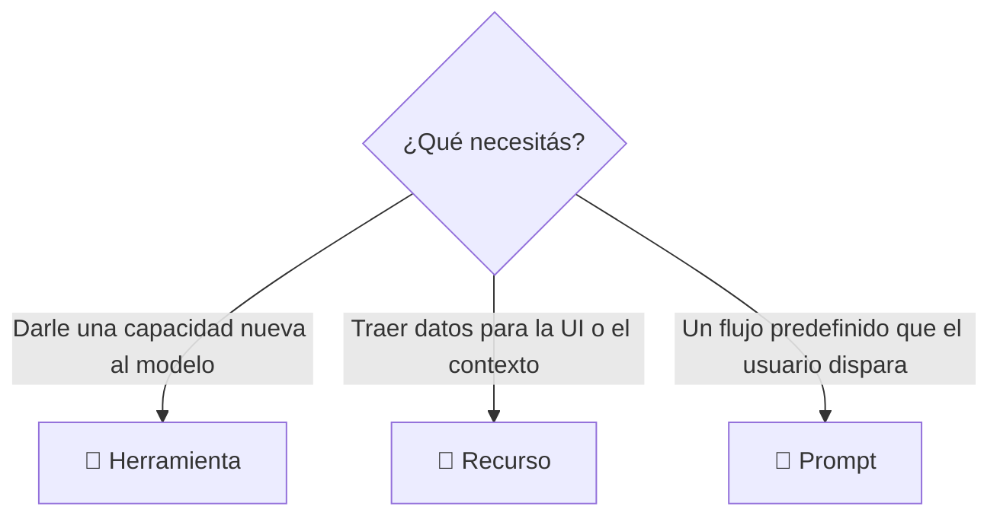

# 07 — Repaso de las 3 primitivas

Ya construimos un servidor MCP completo. Repasemos las **tres primitivas** del servidor y cuándo usar cada una. La clave: **cada primitiva la controla una parte distinta de la pila**.

## Herramientas — controladas por el modelo

Las tools las controla **íntegramente el modelo**. El modelo decide cuándo llamarlas y usa los resultados directamente para resolver tareas.

Son perfectas para darle al modelo **capacidades nuevas** que use de forma autónoma. Cuando le pedís *"calculá la raíz cuadrada de 3 con JavaScript"*, es el modelo quien decide usar una tool de ejecución de JS.

## Recursos — controlados por la aplicación

Los recursos los controla **el código de tu app**. Tu app decide cuándo obtener los datos y cómo usarlos, normalmente para elementos de UI o para sumar contexto a la conversación.

En nuestro proyecto los usamos de dos formas:

- Obtener datos para poblar el **autocompletado** en la UI.
- Recuperar contenido para **complementar prompts** con contexto.

> Pensá en "Agregar desde Google Drive" en la interfaz de Claude: el código de la app decide qué documentos mostrar y se encarga de insertar su contenido en el contexto del chat.

## Prompts — controlados por el usuario

Los prompts se disparan con **acciones del usuario**: clics en botones, selecciones de menú o comandos `/slash`. Son ideales para flujos de trabajo predefinidos que el usuario activa cuando quiere.

> En la interfaz de Claude, los botones de flujo que aparecen debajo del chat son prompts: flujos optimizados que se inician con un clic.

## Elegir la primitiva correcta

| Necesidad | Primitiva |
|-----------|-----------|
| Darle nuevas capacidades al modelo | **Herramientas** |
| Obtener datos para la UI o el contexto | **Recursos** |
| Crear flujos predefinidos para usuarios | **Prompts** |

Podés ver las tres en acción en la interfaz oficial del modelo: los **botones de flujo** muestran prompts, la integración con **Google Drive** muestra recursos, y cuando el modelo **ejecuta código o calcula** usa herramientas internas.

## Para llevar

- **Herramientas → modelo**, **recursos → aplicación**, **prompts → usuario**.
- Cada una sirve a una parte distinta de la pila.
- Son guías generales: elegí según tu caso de uso concreto.

Con esto cerramos el Módulo 1. ➡️ Continuá con el [Módulo 2 — Temas avanzados](../Model%20Context%20Protocol_%20Advanced%20Topics/README.md).
