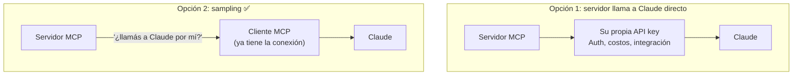
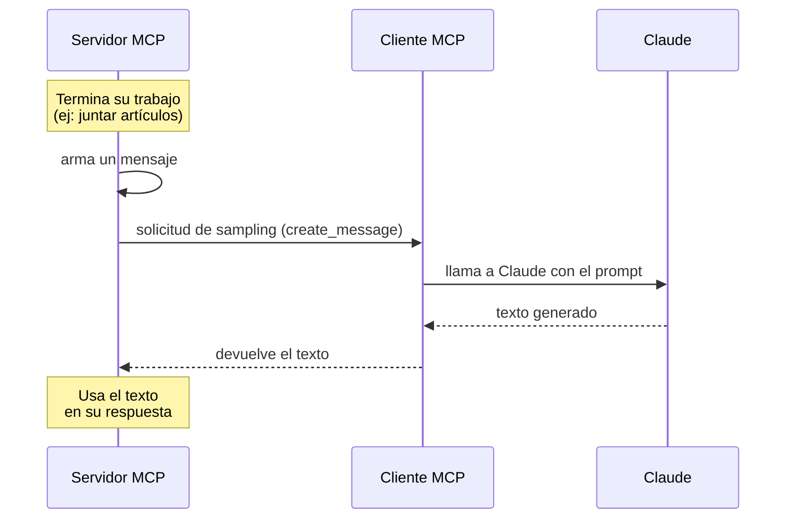

# 01 — Sampling (muestreo)

El **sampling** permite que un servidor MCP acceda a un modelo de lenguaje (como Claude) **a través del cliente** conectado. En lugar de que el servidor llame a Claude directamente, le pide al cliente que haga la llamada en su nombre.

Esto **traslada la responsabilidad y el costo** de la generación de texto del servidor al cliente.

## El problema que resuelve

Imaginá un servidor MCP con una tool de investigación que junta datos de Wikipedia. Después de recopilar todo, necesitás **resumirlo** en un informe coherente. Tenés dos opciones:



- **Opción 1 — acceso directo:** el servidor necesita su propia API key, manejar autenticación, administrar costos e implementar todo el código de integración. Funciona, pero suma mucha complejidad.
- **Opción 2 — sampling:** el servidor arma un mensaje y le pregunta al cliente *"¿podés llamar a Claude por mí?"*. El cliente, que ya tiene la conexión, hace la llamada y devuelve el resultado.

## Cómo funciona



1. El servidor completa su trabajo (ej: obtener artículos).
2. Crea un mensaje que pide generación de texto.
3. Envía una solicitud de sampling al cliente.
4. El cliente llama a Claude con la instrucción.
5. El cliente devuelve el texto generado al servidor.
6. El servidor usa ese texto en su respuesta.

## Beneficios

| Beneficio | Detalle |
|-----------|---------|
| **Menos complejidad en el servidor** | No se integra directo con el modelo |
| **Cambio de carga de costos** | Paga el cliente el uso de tokens, no el servidor |
| **Sin API keys** | El servidor no necesita credenciales de Claude |
| **Ideal para servidores públicos** | No querés que un server público dispare costos de IA por cada usuario |

## Implementación

Requiere código en **ambos lados**.

### Lado del servidor

En la función de la tool usás `create_message` para pedir generación de texto:

```python
@mcp.tool()
async def summarize(text_to_summarize: str, ctx: Context):
    prompt = f"""
    Por favor, resumí el siguiente texto:
    {text_to_summarize}
    """

    result = await ctx.session.create_message(
        messages=[
            SamplingMessage(
                role="user",
                content=TextContent(type="text", text=prompt),
            )
        ],
        max_tokens=4000,
        system_prompt="Sos un asistente de investigación muy útil",
    )

    if result.content.type == "text":
        return result.content.text
    else:
        raise ValueError("Error al hacer sampling")
```

### Lado del cliente

Creás una **callback** de sampling que atiende las solicitudes del servidor:

```python
async def sampling_callback(
    context: RequestContext, params: CreateMessageRequestParams
):
    # Llama a Claude usando el SDK de Anthropic
    text = await chat(params.messages)

    return CreateMessageResult(
        role="assistant",
        model=model,
        content=TextContent(type="text", text=text),
    )
```

Y le pasás la callback al inicializar la sesión:

```python
async with ClientSession(
    read,
    write,
    sampling_callback=sampling_callback,
) as session:
    await session.initialize()
```

## ¿Cuándo usarlo?

El sampling brilla en **servidores MCP públicos**. No querés que usuarios random generen texto ilimitado a costa del servidor. Con sampling, **cada cliente paga su propio uso** de IA mientras aprovecha la funcionalidad del servidor.

En esencia, el sampling **traslada la complejidad** de integrar IA del servidor al cliente, que normalmente ya tiene las conexiones y credenciales necesarias.

## Para llevar

- El servidor delega la llamada al modelo en el cliente (`create_message`).
- El cliente la atiende con una `sampling_callback`.
- Beneficios: menos complejidad, sin API keys en el servidor, el cliente paga los tokens.
- Es una solicitud **servidor → cliente** (importante para el tema de transportes).

➡️ Siguiente: [02 — Logging y notificaciones de progreso](./02-logging-y-progreso.md)
