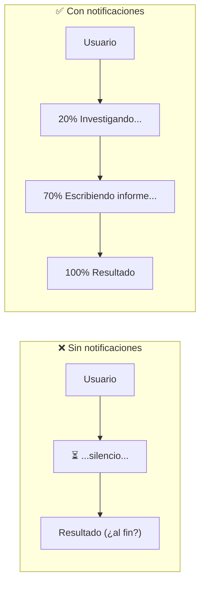
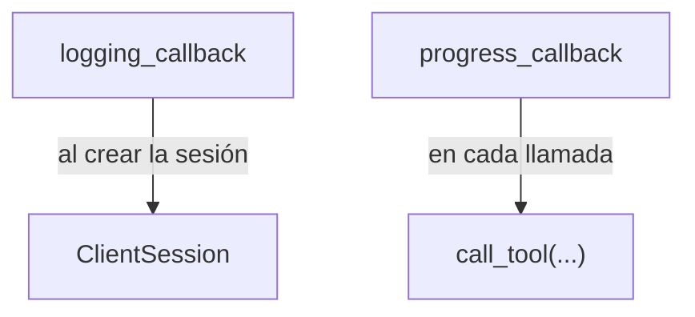

# 02 — Logging y notificaciones de progreso

El **logging** y las **notificaciones de progreso** son fáciles de implementar pero hacen una gran diferencia en la experiencia de usuario. Ayudan a entender **qué está pasando** durante operaciones largas, en lugar de quedarse mirando una pantalla congelada preguntándose si algo se rompió.

## El problema

Cuando Claude ejecuta una tool que tarda —investigar un tema, procesar datos— el usuario normalmente **no ve nada** hasta que termina. Es frustrante: ¿está trabajando o se colgó?



Con logging y progreso activados, el usuario recibe **feedback en tiempo real**: barras de progreso, mensajes de estado y logs mientras la operación corre.

## Cómo funciona

En el SDK de Python, ambos funcionan a través del argumento **`Context`**, que se inyecta automáticamente en las funciones de la tool. Ese objeto ofrece métodos para comunicarse con el cliente durante la ejecución.

```python
@mcp.tool(
    name="research",
    description="Investigar un tema dado",
)
async def research(
    topic: str = Field(description="Tema a investigar"),
    *,
    context: Context,
):
    await context.info("A punto de realizar una investigación...")
    await context.report_progress(20, 100)
    sources = await do_research(topic)

    await context.info("Escribiendo informe...")
    await context.report_progress(70, 100)
    results = await generate_report(sources)

    return results
```

Los métodos clave:

| Método | Para qué |
|--------|----------|
| `context.info()` | Envía mensajes de log al cliente |
| `context.report_progress(actual, total)` | Actualiza el progreso |

## Lado del cliente

El servidor **emite** estos mensajes, pero es tu cliente quien decide **cómo presentarlos**. Configurás callbacks:

```python
async def logging_callback(params: LoggingMessageNotificationParams):
    print(params.data)

async def print_progress_callback(
    progress: float, total: float | None, message: str | None
):
    if total is not None:
        percentage = (progress / total) * 100
        print(f"Progreso: {progress}/{total} ({percentage:.1f}%)")
    else:
        print(f"Progreso: {progress}")

async def run():
    async with stdio_client(server_params) as (read, write):
        async with ClientSession(
            read,
            write,
            logging_callback=logging_callback,
        ) as session:
            await session.initialize()

            await session.call_tool(
                name="add",
                arguments={"a": 1, "b": 3},
                progress_callback=print_progress_callback,
            )
```

Fijate **dónde** va cada callback:



- La callback de **logging** se registra al **crear la sesión** (aplica a todo).
- La callback de **progreso** se pasa en **cada llamada** a una tool puntual.

Esto te da flexibilidad para manejar distintos tipos de notificación por separado.

## Cómo presentarlas

Depende del tipo de app:

| App | Presentación |
|-----|--------------|
| **CLI** | `print` directo a la terminal |
| **Web** | WebSockets, Server-Sent Events o polling al navegador |
| **Escritorio** | Barras de progreso e indicadores en la UI |

> Implementar estas notificaciones es **totalmente opcional**. Podés ignorarlas, mostrar solo algunas o presentarlas como mejor convenga. Son mejoras de UX para operaciones largas.

## Para llevar

- `context.info()` y `context.report_progress()` emiten feedback desde la tool.
- El cliente las consume con `logging_callback` (en la sesión) y `progress_callback` (por llamada).
- Son **notificaciones** (servidor → cliente, sin respuesta esperada): clave para el tema de transportes.
- Opcionales, pero mejoran mucho la experiencia en operaciones largas.

➡️ Siguiente: [03 — Roots](./03-roots.md)
