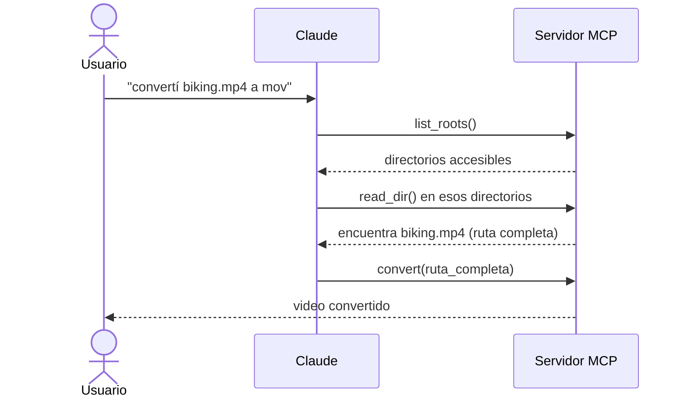
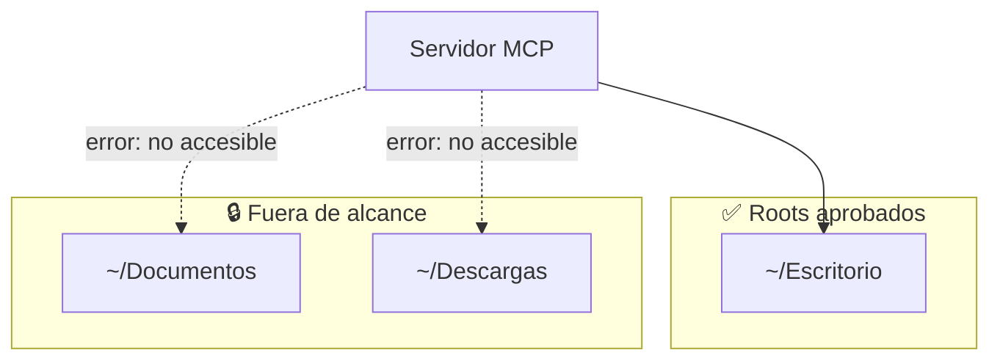

# 03 — Roots (raíces)

Los **roots** son una forma de darle a los servidores MCP acceso a **archivos y carpetas específicos** de tu equipo local. Pensalos como un sistema de permisos que dice: *"servidor MCP, podés acceder a estos archivos"*. Pero hacen más que solo otorgar permisos.

## El problema que resuelven

Imaginá un servidor MCP con una tool de conversión de video que toma una ruta y convierte un MP4 a MOV.

El usuario le pide a Claude *"convertí biking.mp4 a mov"*. Claude llama a la tool con **solo el nombre** del archivo. Pero acá está el problema: **Claude no puede recorrer todo tu sistema de archivos** para encontrar dónde está realmente ese archivo.

Tu sistema puede ser complejo, con archivos dispersos en muchos directorios. El usuario sabe que `biking.mp4` está en su carpeta *Películas*, pero Claude no tiene esa información. Se podría exigir rutas completas siempre, pero nadie quiere escribir paths absolutos cada vez.

## Roots en acción



1. El usuario pide convertir un video.
2. Claude llama a `list_roots` para ver a qué directorios puede acceder.
3. Claude llama a `read_dir` en esos directorios para encontrar el archivo.
4. Una vez encontrado, llama a la tool de conversión con la **ruta completa**.

Todo esto pasa **automáticamente**: el usuario sigue diciendo simplemente *"convertí biking.mp4"* sin dar rutas completas.

## Seguridad y límites

Los roots también aportan **seguridad** al limitar el acceso. Si solo das acceso a la carpeta *Escritorio*, el servidor MCP **no puede** tocar archivos en otras ubicaciones como *Documentos* o *Descargas*.



Cuando Claude intenta acceder a un archivo fuera de los roots aprobados, recibe un error y puede avisarle al usuario que ese archivo no es accesible con la configuración actual.

## Detalles de implementación

> ⚠️ El SDK de MCP **no aplica** las restricciones de roots por vos: las implementás vos mismo.

El patrón típico es una función auxiliar como `is_path_allowed()` que:

1. Toma la ruta solicitada.
2. Obtiene la lista de roots aprobados.
3. Verifica si la ruta cae **dentro** de alguno de esos roots.
4. Devuelve `True`/`False` para el permiso.

```python
def is_path_allowed(requested_path: str, roots: list[str]) -> bool:
    requested = os.path.abspath(requested_path)
    for root in roots:
        if requested.startswith(os.path.abspath(root)):
            return True
    return False
```

Después llamás a esta función en **cualquier tool** que toque archivos, **antes** de hacer la operación real.

## Beneficios clave

| Beneficio | Detalle |
|-----------|---------|
| **Fácil de usar** | El usuario no escribe rutas completas |
| **Búsqueda enfocada** | Claude busca solo en directorios aprobados (más rápido) |
| **Seguridad** | Evita el acceso accidental a archivos sensibles |
| **Flexibilidad** | Podés dar roots vía tools o inyectarlos en los prompts |

Los roots hacen a los servidores MCP **más potentes y más seguros**: le dan a Claude el contexto para encontrar archivos, manteniendo límites claros sobre qué puede tocar.

## Para llevar

- Los roots declaran qué archivos/carpetas locales puede ver el servidor.
- Resuelven el problema de "Claude no sabe dónde está el archivo".
- Aportan seguridad limitando el alcance.
- El enforcement es **tu responsabilidad** (`is_path_allowed()`).
- `list_roots` es una solicitud **servidor → cliente** (igual que sampling).

➡️ Siguiente: [04 — Tipos de mensajes JSON](./04-mensajes-json.md)
