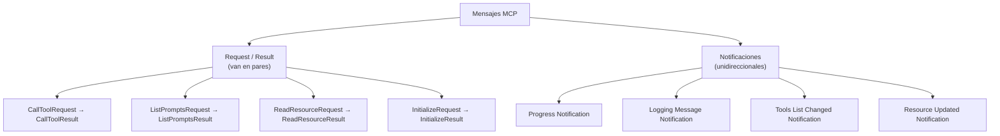
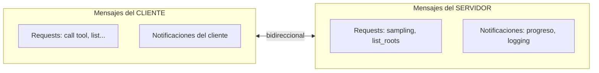

# 04 — Tipos de mensajes JSON

MCP usa **mensajes JSON** para toda la comunicación entre clientes y servidores. Entender estos tipos es fundamental, sobre todo al trabajar con distintos transportes (como StreamableHTTP).

## Formato del mensaje

Toda la comunicación de MCP son mensajes JSON. Cada tipo tiene un propósito específico: llamar una tool, listar recursos, enviar notificaciones de eventos, etc.

Ejemplo típico: cuando Claude necesita llamar una tool de un servidor MCP, el cliente envía un mensaje **"Call Tool Request"**. El servidor lo procesa, ejecuta la tool y responde con un **"Call Tool Result"** con la salida.

## La especificación MCP

La lista completa de tipos de mensajes está en el **repositorio oficial de la especificación** de MCP en GitHub. Esta spec es **independiente** de los SDKs (Python, TypeScript, etc.) y es la fuente autorizada de cómo debe funcionar MCP.

> Los tipos están escritos en **TypeScript** por comodidad —no porque se ejecuten como TS— sino porque TypeScript describe estructuras y tipos de datos de forma clara.

## Dos categorías de mensajes

### Mensajes Request / Result

Vienen **siempre en pares**: enviás una solicitud y esperás una respuesta.

- `CallToolRequest` → `CallToolResult`
- `ListPromptsRequest` → `ListPromptsResult`
- `ReadResourceRequest` → `ReadResourceResult`
- `InitializeRequest` → `InitializeResult`

### Mensajes de notificación

Son **unidireccionales**: informan de un evento pero **no esperan respuesta**.

- **Progress Notification** — actualizaciones de operaciones largas.
- **Logging Message Notification** — mensajes de log del sistema.
- **Tools List Changed Notification** — cambió el set de tools disponibles.
- **Resource Updated Notification** — se modificó un recurso.

## Mensajes de cliente vs de servidor

La spec organiza los mensajes según **quién los envía**:

- **Mensajes del cliente:** las solicitudes que el cliente manda al servidor (como llamadas a tools) y sus notificaciones.
- **Mensajes del servidor:** las solicitudes que el servidor manda al cliente (sampling, roots) y las notificaciones que transmite.

## Por qué importa

Es clave entender que **los servidores también pueden enviar mensajes a los clientes**. MCP está diseñado como un protocolo **bidireccional**: tanto cliente como servidor pueden iniciar la comunicación.

Esto se vuelve crucial al elegir transporte: algunos métodos (como StreamableHTTP) tienen **limitaciones** sobre qué tipos de mensaje pueden fluir en qué dirección. Por eso conviene tener clara esta clasificación antes de meterse con los transportes.

## Para llevar

- Toda la comunicación MCP son **mensajes JSON**.
- Dos categorías: **request/result** (en pares) y **notificaciones** (unidireccionales).
- La spec (independiente de los SDKs) los clasifica por **cliente** o **servidor**.
- MCP es **bidireccional**: el servidor también inicia mensajes hacia el cliente. Esto es lo que ciertos transportes complican.

➡️ Siguiente: [05 — Transporte STDIO](./05-transporte-stdio.md)
