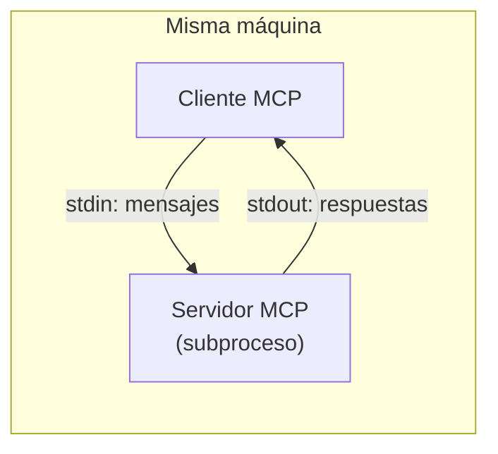
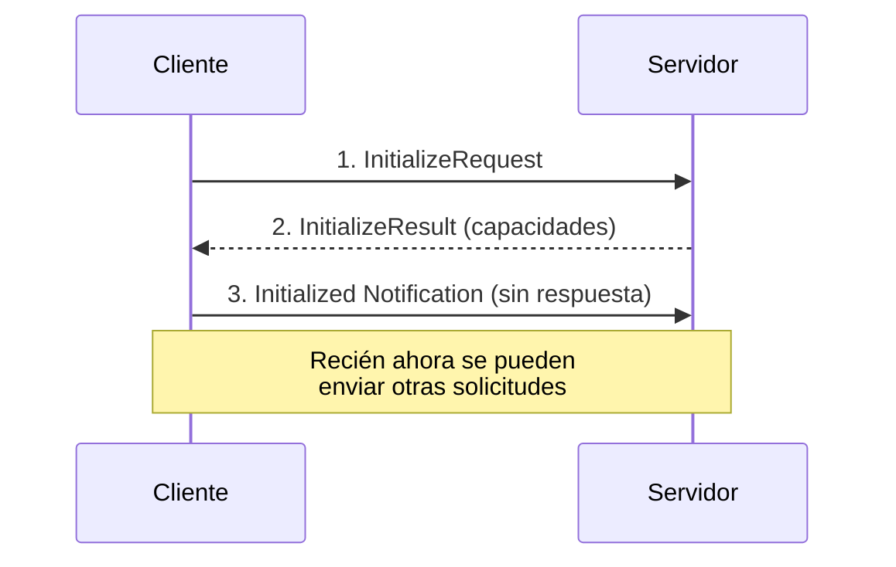
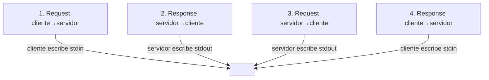

# 05 — Transporte STDIO

Clientes y servidores MCP se comunican intercambiando mensajes JSON. ¿Pero cómo se transmiten físicamente esos mensajes? El canal usado se llama **transporte**, y hay varias formas de implementarlo: desde HTTP y WebSockets hasta... escribir JSON en una postal (no recomendado para producción 😉).

## El transporte stdio

Al desarrollar tu primer servidor o cliente MCP, el transporte más común es **entrada/salida estándar (stdio)**. La idea es simple: el cliente **arranca el servidor MCP como un subproceso** y se comunican por los flujos estándar.



Cómo funciona:

- El cliente envía mensajes al servidor por su **entrada estándar (stdin)**.
- El servidor responde escribiendo en su **salida estándar (stdout)**.
- **Tanto** el servidor como el cliente pueden enviar un mensaje en cualquier momento.
- Solo funciona cuando **ambos corren en la misma máquina**.

## Probarlo en la terminal

Podés probar un servidor MCP directamente desde la terminal, sin escribir un cliente aparte. Al correr:

```bash
uv run server.py
```

el servidor escucha en stdin y escribe respuestas en stdout. Es decir, podés **pegar mensajes JSON** directamente en la terminal y ver las respuestas al instante. La salida muestra el intercambio completo, incluyendo la inicialización y las llamadas a tools.

## La secuencia de conexión (handshake)

Toda conexión MCP **debe** empezar con un handshake de **tres mensajes**:



1. **InitializeRequest** — el cliente lo envía primero.
2. **InitializeResult** — el servidor responde con sus capacidades.
3. **Initialized Notification** — el cliente confirma (no espera respuesta).

Solo **después** de este handshake podés enviar otras solicitudes (llamadas a tools, listados de prompts, etc.).

## Cuatro escenarios de comunicación

En cualquier transporte hay que manejar cuatro patrones. Con stdio, cada uno mapea a un flujo estándar:



| Escenario | Cómo se hace |
|-----------|--------------|
| Request cliente → servidor | El cliente escribe en stdin |
| Response servidor → cliente | El servidor escribe en stdout |
| Request servidor → cliente | El servidor escribe en stdout |
| Response cliente → servidor | El cliente escribe en stdin |

La ventaja de stdio es su **simplicidad**: cualquiera de las partes puede iniciar la comunicación en cualquier momento usando estos dos canales.

## Por qué importa

stdio representa el **caso ideal**, donde la comunicación bidireccional fluye sin fricción. Es el punto de partida perfecto para entender cómo funciona MCP completo **antes** de toparse con las limitaciones de otros transportes (como HTTP, donde el servidor **no siempre** puede iniciar solicitudes hacia el cliente).

- Para **desarrollo y pruebas**: stdio es perfecto.
- Para **producción** donde cliente y servidor corren en máquinas distintas: necesitás otro transporte, con sus pros y contras.

## Para llevar

- stdio = el cliente lanza el servidor como subproceso; se comunican por stdin/stdout.
- Solo funciona en la **misma máquina**.
- Toda conexión empieza con el **handshake de 3 mensajes** (initialize).
- Soporta comunicación **bidireccional fluida**: el caso ideal, base para entender el resto.

➡️ Siguiente: [06 — Transporte StreamableHTTP](./06-streamable-http.md)
