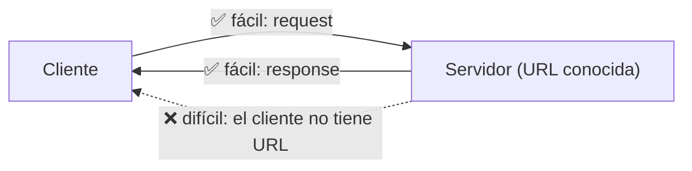
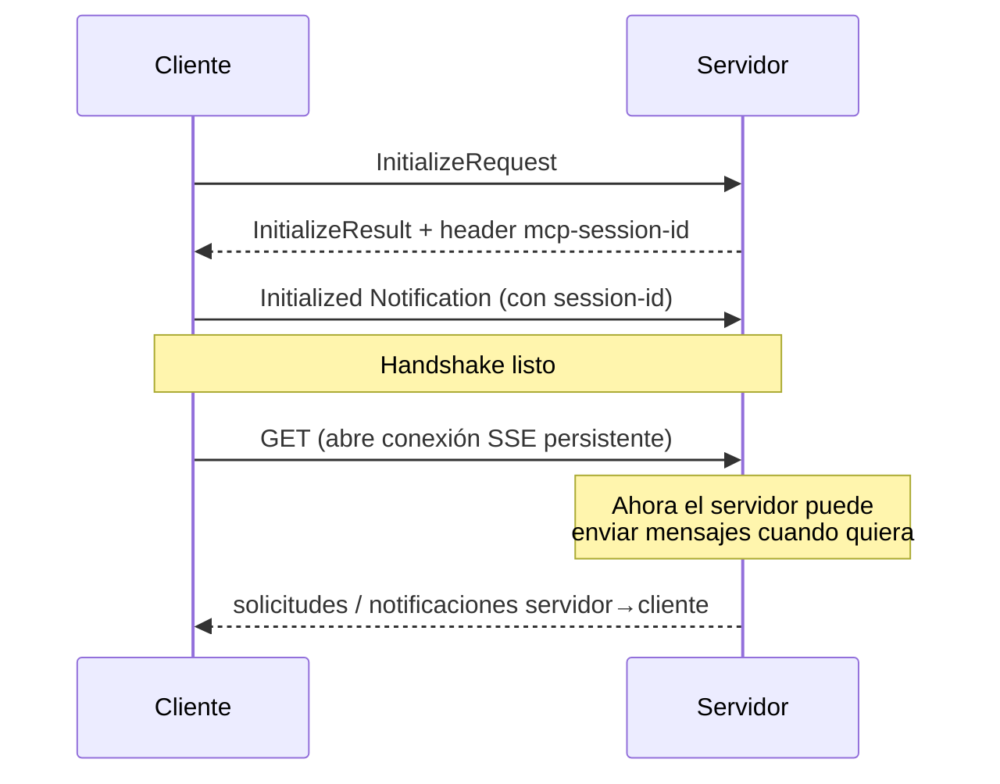
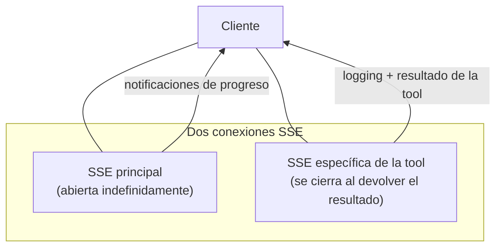
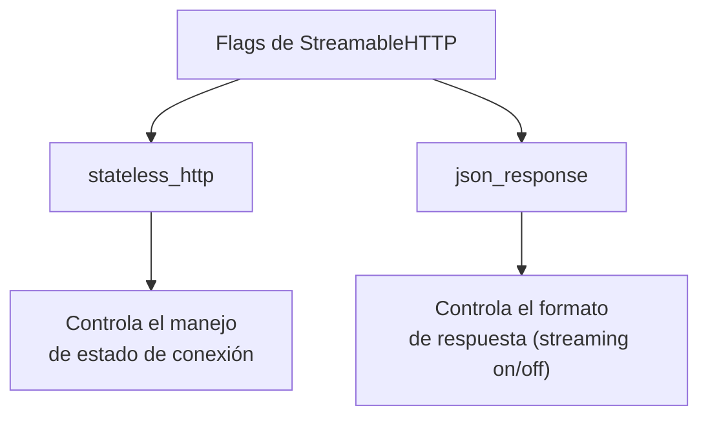
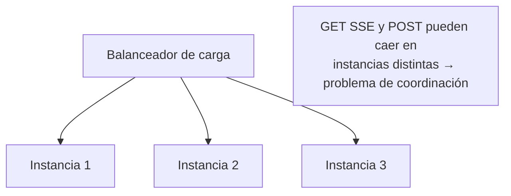
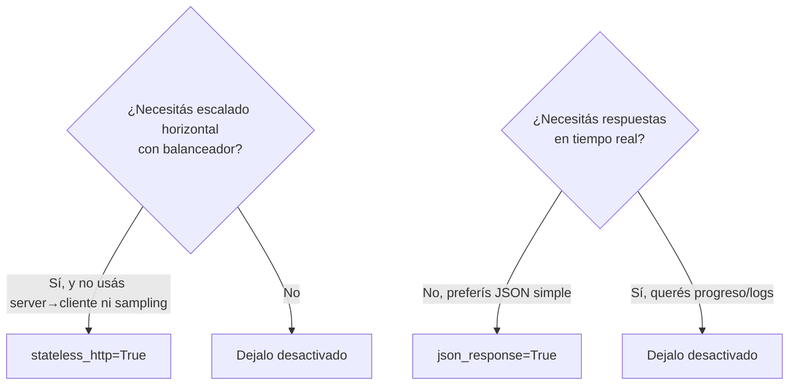

# 06 — Transporte StreamableHTTP

El transporte **StreamableHTTP** permite que los clientes MCP se conecten a servidores **alojados remotamente** por HTTP. A diferencia de [stdio](./05-transporte-stdio.md) —que exige cliente y servidor en la misma máquina— este transporte abre la puerta a **servidores MCP públicos** a los que cualquiera puede acceder.

> ⚠️ **Advertencia clave:** ciertas configuraciones pueden **limitar mucho** la funcionalidad de tu servidor. Si tu app anda perfecto con stdio en local pero falla al deployar con HTTP, probablemente sea por esto.

## El desafío de HTTP

Para entender las limitaciones, repasemos cómo funciona HTTP:

- Los clientes inician solicitudes a los servidores fácil (el servidor tiene URL conocida).
- Los servidores responden fácil.
- Los servidores **no pueden** iniciar solicitudes a los clientes fácilmente (los clientes no tienen URL conocida).

### Qué se rompe

Justo las funciones que dependen de solicitudes **servidor → cliente** se vuelven difíciles sobre HTTP plano:

- **Solicitudes iniciadas por el servidor:** [sampling](./01-sampling.md) (create message), [roots](./03-roots.md) (list roots).
- **Notificaciones:** [progreso, logging](./02-logging-y-progreso.md), initialized, cancelación.

Con HTTP restrictivo: las barras de progreso desaparecen, el logging deja de funcionar y el sampling iniciado por el servidor falla.

## La solución: SSE

StreamableHTTP sortea la limitación con **Server-Sent Events (SSE)**: una respuesta HTTP **persistente** que el servidor puede usar para mandarle mensajes al cliente en cualquier momento.

### Configuración inicial

1. El cliente envía `InitializeRequest`.
2. El servidor responde con `InitializeResult` que incluye un header especial **`mcp-session-id`**.
3. El cliente envía la `Initialized Notification` con ese session-id.

> El **session-id** es crucial: identifica de forma única al cliente y debe ir en **todas** las solicitudes posteriores.

### Conexiones SSE duales

Cuando el cliente hace una llamada a una tool, el sistema crea **dos** conexiones SSE separadas:

| Conexión | Para qué | Duración |
|----------|----------|----------|
| **SSE principal** | Solicitudes iniciadas por el servidor | Abierta indefinidamente |
| **SSE de la tool** | Logging y resultado de esa tool | Se cierra al enviar el resultado |

Enrutamiento de mensajes:

- **Notificaciones de progreso** → conexión SSE **principal**.
- **Logging y resultado de la tool** → conexión SSE **específica de la tool**.

## Los dos flags que rompen la solución

StreamableHTTP tiene dos opciones de configuración importantes. **Por defecto ambas están desactivadas.** Activarlas puede romper el mecanismo SSE.

### `stateless_http=True`

Sirve para **escalar horizontalmente**. Imaginá que tu servidor se vuelve popular: miles de clientes, varias instancias detrás de un **balanceador de carga**.

El problema: un cliente necesita **dos conexiones** (un `GET` SSE para recibir solicitudes servidor→cliente, y `POST` para llamar tools). Con un balanceador, podrían caer en instancias distintas. Si tu tool necesita Claude (vía sampling), la instancia que atiende el POST tendría que coordinarse con la que tiene el GET SSE: un lío de coordinación entre servidores.

`stateless_http=True` elimina ese problema de coordinación, **pero con costos importantes**:

| Con stateless HTTP | Consecuencia |
|--------------------|--------------|
| Sin session-id | El servidor no puede rastrear clientes individuales |
| Sin GET SSE | ❌ No hay solicitudes servidor → cliente |
| Sin sampling | ❌ No se puede usar Claude desde el servidor |
| Sin progreso | ❌ No hay updates durante operaciones largas |
| Sin suscripciones | ❌ No se notifican actualizaciones de recursos |
| ✅ Ventaja | Ya no se requiere la inicialización del cliente; los clientes hacen solicitudes directas |

### `json_response=True`

Más simple: **desactiva el streaming** de las respuestas a los POST. En vez de varios mensajes SSE a medida que la tool corre, recibís solo el **resultado final** en JSON plano.

Con streaming desactivado:

- Sin mensajes de progreso intermedios.
- Sin logs durante la ejecución.
- Solo el resultado final de la tool.

## Cuándo usar cada flag

**Usá `stateless_http`** cuando: necesitás escalado horizontal, no requerís comunicación servidor→cliente, tus tools no usan sampling, y querés minimizar overhead de conexión.

**Usá `json_response`** cuando: no necesitás respuestas en tiempo real, preferís respuestas HTTP más simples, o te integrás con sistemas que esperan JSON plano.

## Desarrollo vs. producción

> Si desarrollás localmente con **stdio** pero vas a deployar con **HTTP**, **probá con el mismo transporte** que usarás en producción. Las diferencias entre modo con estado y sin estado pueden ser grandes; mejor detectarlas en desarrollo que después del deploy.

## Para llevar

- StreamableHTTP habilita servidores MCP **remotos/públicos** sobre HTTP.
- Usa **SSE** (conexiones persistentes) para resolver el problema servidor→cliente que HTTP plano no permite.
- Tras el handshake, el **`mcp-session-id`** va en todas las solicitudes; hay un modelo de **doble conexión SSE**.
- `stateless_http=True` permite escalar pero **mata** sampling, progreso y server→cliente.
- `json_response=True` desactiva el streaming (solo resultado final).
- Probá siempre con el transporte de producción.

Con esto cerramos el Módulo 2. ⬅️ Volvé al [índice del repo](../README.md).
