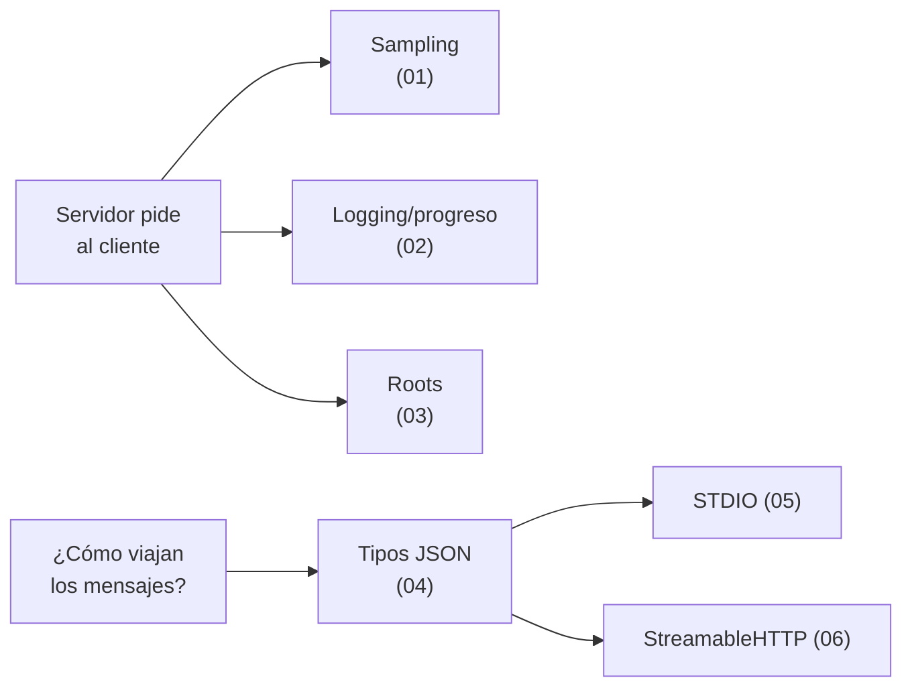

# Módulo 2 — Temas avanzados de MCP

Capacidades avanzadas del protocolo, más allá de las tres primitivas básicas. Acá vemos cómo el **servidor puede pedirle cosas al cliente** (sampling, notificaciones), cómo dar **acceso controlado a archivos** (roots) y cómo **viajan realmente los mensajes** (transportes STDIO y StreamableHTTP).

> Requisito previo: el [Módulo 1](../Introduction%20to%20Model%20Context%20Protocol/README.md). Acá asumimos que ya conocés tools, recursos, prompts y el flujo cliente/servidor.

## Ruta de lectura

| # | Nota | Qué cubre |
|---|------|-----------|
| 01 | [Sampling](./01-sampling.md) | El servidor le pide al cliente que llame a Claude |
| 02 | [Logging y progreso](./02-logging-y-progreso.md) | Feedback en tiempo real durante operaciones largas |
| 03 | [Roots](./03-roots.md) | Acceso controlado a archivos y carpetas locales |
| 04 | [Mensajes JSON](./04-mensajes-json.md) | Tipos de mensajes: request/result y notificaciones |
| 05 | [Transporte STDIO](./05-transporte-stdio.md) | El transporte por defecto: entrada/salida estándar |
| 06 | [StreamableHTTP](./06-streamable-http.md) | Servidores remotos sobre HTTP + SSE, y modo stateless |

## Hilo conductor



Las primeras tres notas (sampling, logging, roots) dependen de que **el servidor inicie solicitudes hacia el cliente**. Las últimas tres explican el transporte, y por qué **HTTP complica** justamente esas solicitudes servidor→cliente.

## Proyectos

| Carpeta | Tema |
|---------|------|
| [`sampling/`](./sampling/) | Servidor que delega la generación de texto al cliente |
| [`notifications/`](./notifications/) | Logging y notificaciones de progreso |
| [`roots/`](./roots/) | Conversor de video con acceso por roots |
| [`transport-http/`](./transport-http/) | Servidor MCP sobre StreamableHTTP |

Cada proyecto trae su `README.md` y `pyproject.toml`. Flujo general:

```bash
cd sampling
uv sync
uv run server.py    # o el comando que indique el README del proyecto
```
