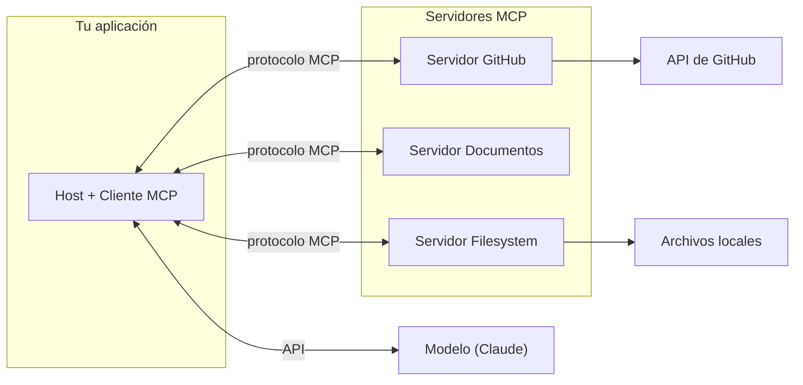

# Curso de Model Context Protocol (MCP)

Apuntes en español y proyectos de ejemplo para aprender el **Model Context Protocol (MCP)**: el estándar abierto que conecta modelos como Claude con herramientas, datos y servicios externos sin tener que escribir toda la integración a mano.

El material está organizado en dos módulos. Cada módulo combina:

- **Notas teóricas** (archivos `.md` numerados, con diagramas) que explican cada concepto paso a paso.
- **Proyectos Python** ejecutables que implementan esos conceptos con el SDK oficial de MCP.

> Las notas son una reelaboración en español del contenido del curso, con diagramas propios para fijar las ideas.

---

## ¿Qué es MCP en una frase?

MCP es una **capa de comunicación estandarizada** entre tu aplicación (el host/cliente) y servidores que exponen *herramientas*, *recursos* y *prompts*. En lugar de programar cada integración con GitHub, una base de datos o el sistema de archivos, te conectás a un **servidor MCP** que ya hace ese trabajo.



---

## Módulos

### [Módulo 1 — Introducción a MCP](./Introduction%20to%20Model%20Context%20Protocol/)

Fundamentos: qué problema resuelve MCP, su arquitectura, y cómo construir un servidor y un cliente completos con las tres primitivas (herramientas, recursos y prompts).

| # | Tema | Nota |
|---|------|------|
| 01 | Qué es MCP y qué problema resuelve | [01-que-es-mcp.md](./Introduction%20to%20Model%20Context%20Protocol/01-que-es-mcp.md) |
| 02 | Arquitectura y flujo de mensajes | [02-arquitectura-y-flujo.md](./Introduction%20to%20Model%20Context%20Protocol/02-arquitectura-y-flujo.md) |
| 03 | Herramientas (tools) e Inspector | [03-herramientas-e-inspector.md](./Introduction%20to%20Model%20Context%20Protocol/03-herramientas-e-inspector.md) |
| 04 | Implementar el cliente MCP | [04-cliente-mcp.md](./Introduction%20to%20Model%20Context%20Protocol/04-cliente-mcp.md) |
| 05 | Recursos (resources) | [05-recursos.md](./Introduction%20to%20Model%20Context%20Protocol/05-recursos.md) |
| 06 | Prompts (indicaciones) | [06-prompts.md](./Introduction%20to%20Model%20Context%20Protocol/06-prompts.md) |
| 07 | Repaso de las 3 primitivas | [07-primitivas-mcp.md](./Introduction%20to%20Model%20Context%20Protocol/07-primitivas-mcp.md) |

**Proyectos:** `cli_project/` (base para completar) y `cli_project_COMPLETE/` (solución).

### [Módulo 2 — Temas avanzados](./Model%20Context%20Protocol_%20Advanced%20Topics/)

Capacidades avanzadas del protocolo: pedirle al cliente que llame al modelo (sampling), feedback en tiempo real (logging/progreso), acceso controlado a archivos (roots), y cómo viajan los mensajes (transportes STDIO y StreamableHTTP).

| # | Tema | Nota |
|---|------|------|
| 01 | Sampling (muestreo) | [01-sampling.md](./Model%20Context%20Protocol_%20Advanced%20Topics/01-sampling.md) |
| 02 | Logging y notificaciones de progreso | [02-logging-y-progreso.md](./Model%20Context%20Protocol_%20Advanced%20Topics/02-logging-y-progreso.md) |
| 03 | Roots (raíces) | [03-roots.md](./Model%20Context%20Protocol_%20Advanced%20Topics/03-roots.md) |
| 04 | Tipos de mensajes JSON | [04-mensajes-json.md](./Model%20Context%20Protocol_%20Advanced%20Topics/04-mensajes-json.md) |
| 05 | Transporte STDIO | [05-transporte-stdio.md](./Model%20Context%20Protocol_%20Advanced%20Topics/05-transporte-stdio.md) |
| 06 | Transporte StreamableHTTP | [06-streamable-http.md](./Model%20Context%20Protocol_%20Advanced%20Topics/06-streamable-http.md) |

**Proyectos:** `notifications/`, `roots/`, `sampling/`, `transport-http/`.

---

## Requisitos

- **Python 3.10+**
- **[uv](https://docs.astral.sh/uv/)** como gestor de entornos y dependencias.
- Una **API key de Anthropic** (para los proyectos que llaman a Claude), en un archivo `.env`:

  ```env
  ANTHROPIC_API_KEY=tu_api_key
  CLAUDE_MODEL=claude-sonnet-4-6
  ```

## Cómo correr un proyecto

Cada proyecto trae su propio `pyproject.toml` y `README.md`. El flujo general:

```bash
# Posicionarse en el proyecto, por ejemplo:
cd "Introduction to Model Context Protocol/cli_project_COMPLETE"

# Instalar dependencias en un entorno aislado
uv sync

# Probar el servidor con el Inspector (UI en el navegador)
uv run mcp dev mcp_server.py

# O correr la aplicación CLI completa
uv run main.py
```

## Enlaces oficiales

- **Empezá acá (documentación oficial):** <https://modelcontextprotocol.io/docs/getting-started/intro>
- Introducción a MCP: <https://modelcontextprotocol.io/introduction>
- Especificación del protocolo: <https://spec.modelcontextprotocol.io>
- Guía de instalación de uv: <https://docs.astral.sh/uv/>
