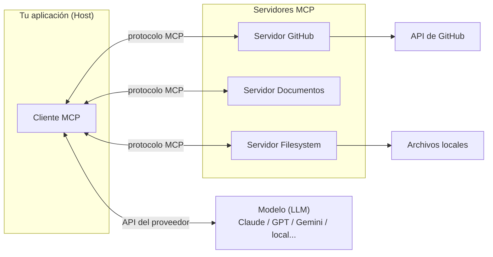
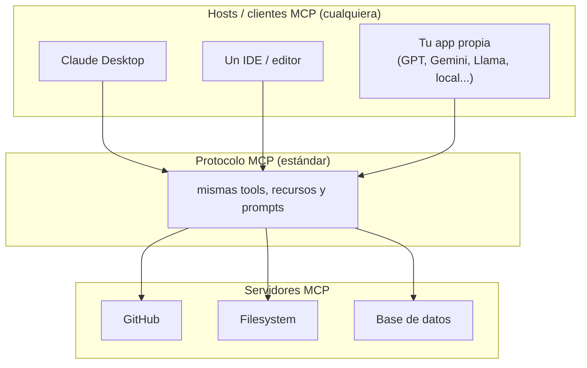

# Curso de Model Context Protocol (MCP)

Apuntes en español y proyectos de ejemplo para aprender el **Model Context Protocol (MCP)**: el estándar abierto que conecta modelos de lenguaje (LLMs) con herramientas, datos y servicios externos sin tener que escribir toda la integración a mano.

> **MCP es independiente del modelo.** Es un estándar abierto: el mismo servidor MCP funciona con cualquier LLM y cualquier aplicación que implemente el protocolo. Los proyectos de ejemplo de este curso usan Claude (vía el SDK de Anthropic) como **una** implementación concreta, pero el cliente y el modelo son intercambiables. Ver [Independiente del modelo](#independiente-del-modelo-model-agnostic).

El material está organizado en dos módulos. Cada módulo combina:

- **Notas teóricas** (archivos `.md` numerados, con diagramas) que explican cada concepto paso a paso.
- **Proyectos Python** ejecutables que implementan esos conceptos con el SDK oficial de MCP.

> Las notas son una reelaboración en español del contenido del curso, con diagramas propios para fijar las ideas.

---

## ¿Qué es MCP en una frase?

MCP es una **capa de comunicación estandarizada** entre tu aplicación (el host/cliente) y servidores que exponen *herramientas*, *recursos* y *prompts*. En lugar de programar cada integración con GitHub, una base de datos o el sistema de archivos, te conectás a un **servidor MCP** que ya hace ese trabajo.



---

## Independiente del modelo (model-agnostic)

MCP **no está atado a ningún proveedor de IA**. Es un estándar abierto, igual que HTTP: define *cómo* se hablan cliente y servidor, no *qué* modelo hay detrás.



Qué significa en la práctica:

- **El servidor MCP no sabe ni le importa qué LLM lo usa.** Exponé tus tools una vez y sirven para cualquier cliente compatible.
- **El LLM es un componente intercambiable del host.** En este curso el host llama a Claude, pero podés cambiar esa parte por GPT, Gemini, Llama, un modelo local, etc., sin tocar el servidor MCP.
- **En las notas decimos "el modelo" o "el LLM"** para referirnos a ese rol genérico. Cuando aparece *Claude* o *Anthropic*, es porque se está hablando de la **implementación concreta de ejemplo** (el SDK que usan los proyectos), no de un requisito del protocolo.

> Para adaptar los ejemplos a otro proveedor, reemplazá la capa que llama al modelo (en los proyectos, `core/claude.py`) por el SDK del proveedor que prefieras. El código MCP (servidor, tools, recursos, prompts) queda igual.

---

## Módulos

### [Módulo 1 — Introducción a MCP](./Introduction%20to%20Model%20Context%20Protocol/)

Fundamentos: qué problema resuelve MCP, su arquitectura, y cómo construir un servidor y un cliente completos con las tres primitivas (herramientas, recursos y prompts).

| # | Tema | Nota |
|---|------|------|
| 01 | Qué es MCP y qué problema resuelve | [01-que-es-mcp.md](./Introduction%20to%20Model%20Context%20Protocol/01-que-es-mcp.md) |
| 02 | Arquitectura y flujo de mensajes | [02-arquitectura-y-flujo.md](./Introduction%20to%20Model%20Context%20Protocol/02-arquitectura-y-flujo.md) |
| 03 | Herramientas (tools) e Inspector | [03-herramientas-e-inspector.md](./Introduction%20to%20Model%20Context%20Protocol/03-herramientas-e-inspector.md) |
| 04 | Implementar el cliente MCP | [04-cliente-mcp.md](./Introduction%20to%20Model%20Context%20Protocol/04-cliente-mcp.md) |
| 05 | Recursos (resources) | [05-recursos.md](./Introduction%20to%20Model%20Context%20Protocol/05-recursos.md) |
| 06 | Prompts (indicaciones) | [06-prompts.md](./Introduction%20to%20Model%20Context%20Protocol/06-prompts.md) |
| 07 | Repaso de las 3 primitivas | [07-primitivas-mcp.md](./Introduction%20to%20Model%20Context%20Protocol/07-primitivas-mcp.md) |

**Proyectos:** `cli_project/` (base para completar) y `cli_project_COMPLETE/` (solución).

### [Módulo 2 — Temas avanzados](./Model%20Context%20Protocol_%20Advanced%20Topics/)

Capacidades avanzadas del protocolo: pedirle al cliente que llame al modelo (sampling), feedback en tiempo real (logging/progreso), acceso controlado a archivos (roots), y cómo viajan los mensajes (transportes STDIO y StreamableHTTP).

| # | Tema | Nota |
|---|------|------|
| 01 | Sampling (muestreo) | [01-sampling.md](./Model%20Context%20Protocol_%20Advanced%20Topics/01-sampling.md) |
| 02 | Logging y notificaciones de progreso | [02-logging-y-progreso.md](./Model%20Context%20Protocol_%20Advanced%20Topics/02-logging-y-progreso.md) |
| 03 | Roots (raíces) | [03-roots.md](./Model%20Context%20Protocol_%20Advanced%20Topics/03-roots.md) |
| 04 | Tipos de mensajes JSON | [04-mensajes-json.md](./Model%20Context%20Protocol_%20Advanced%20Topics/04-mensajes-json.md) |
| 05 | Transporte STDIO | [05-transporte-stdio.md](./Model%20Context%20Protocol_%20Advanced%20Topics/05-transporte-stdio.md) |
| 06 | Transporte StreamableHTTP | [06-streamable-http.md](./Model%20Context%20Protocol_%20Advanced%20Topics/06-streamable-http.md) |

**Proyectos:** `notifications/`, `roots/`, `sampling/`, `transport-http/`.

---

## Requisitos

- **Python 3.10+**
- **[uv](https://docs.astral.sh/uv/)** como gestor de entornos y dependencias.
- Una **API key del proveedor de LLM**. Los proyectos de ejemplo vienen cableados a Claude, así que usan una **API key de Anthropic** en un archivo `.env` (si adaptás los ejemplos a otro proveedor, cambiá esta credencial y la capa que llama al modelo):

  ```env
  ANTHROPIC_API_KEY=tu_api_key
  CLAUDE_MODEL=claude-sonnet-4-6
  ```

## Cómo correr un proyecto

Cada proyecto trae su propio `pyproject.toml` y `README.md`. El flujo general:

```bash
# Posicionarse en el proyecto, por ejemplo:
cd "Introduction to Model Context Protocol/cli_project_COMPLETE"

# Instalar dependencias en un entorno aislado
uv sync

# Probar el servidor con el Inspector (UI en el navegador)
uv run mcp dev mcp_server.py

# O correr la aplicación CLI completa
uv run main.py
```

## Enlaces oficiales

- **Empezá acá (documentación oficial):** <https://modelcontextprotocol.io/docs/getting-started/intro>
- Introducción a MCP: <https://modelcontextprotocol.io/introduction>
- Especificación del protocolo: <https://spec.modelcontextprotocol.io>
- Guía de instalación de uv: <https://docs.astral.sh/uv/>

## Créditos y atribución

El material teórico y los proyectos de ejemplo están basados en los cursos de **Anthropic** sobre Model Context Protocol: *Introduction to Model Context Protocol* y *Model Context Protocol: Advanced Topics*. Los documentos fuente originales se conservan en [`assets/`](./assets/).

Las **notas en español** (archivos `.md`) y los **diagramas** son una reelaboración propia de ese material. El **código** de los proyectos de ejemplo pertenece a sus autores originales (Anthropic) y se incluye con fines educativos.

> Si sos el autor del material original y querés ajustar la atribución o el alcance de uso, abrí un issue.

## Licencia

El trabajo propio de este repositorio (notas en español, diagramas y documentación) se publica bajo licencia [MIT](./LICENSE).

La licencia MIT cubre la reelaboración propia; **no** se extiende al material original del curso ni al código de ejemplo de terceros, que conservan los derechos de sus autores.
